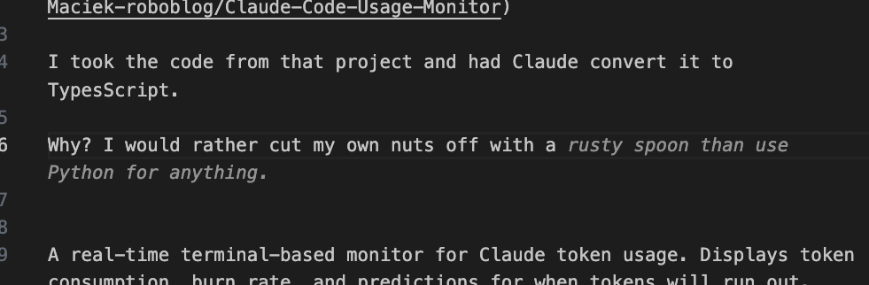

# Claude Usage Monitor - Typescript Turbo Edition.
Credit to -> [Claude Code Usage Monitor](https://github.com/Maciek-roboblog/Claude-Code-Usage-Monitor)

I took the code from that project and had Claude convert it to TypesScript.

Why? I would rather cut my own nuts off with a rusty spoon than use Python for anything.




A real-time terminal-based monitor for Claude token usage. Displays token consumption, burn rate, and predictions for when tokens will run out.


## Features

- Real-time token usage tracking with visual progress bars
- Burn rate calculation based on the last hour of activity
- Predictions for when tokens will be depleted
- Support for different Claude plans (Pro, Max5, Max20)
- Automatic detection of custom token limits
- Customizable reset times and timezone settings
- Color-coded alerts and warnings

## Installation

```bash
# Clone the repository
git clone <repository-url>
cd claude-usage

# Install dependencies
pnpm install
# or
npm install
```

## Prerequisites

- Node.js 18 or higher
- `ccusage` CLI tool installed globally and accessible in PATH

### Installing ccusage

First, you must install the `ccusage` CLI tool globally:

```bash
npm install -g ccusage
```

This tool is required to fetch Claude usage data from the Anthropic API.

## Usage

### Running the Monitor

Simply run the monitor without any arguments:

```bash
pnpm monitor
```

The application features an interactive menu system that guides you through setup. No command-line arguments are needed. The menu allows you to:

1. **Select your Claude plan:**
   - Pro (7,000 tokens)
   - Max5 (35,000 tokens)  
   - Max20 (140,000 tokens)
   - Custom Max (auto-detect from highest previous usage)

2. **Choose reset schedule:**
   - Default: 5-hour intervals at 04:00, 09:00, 14:00, 18:00, 23:00
   - Custom: Set your own reset hour (0-23)

All times are automatically displayed in your local system timezone.

## Display Information

The monitor shows:

1. **Token Usage**: Visual progress bar showing current usage percentage
2. **Time to Reset**: Time remaining until next token reset
3. **Token Details**: Current usage, limit, and remaining tokens
4. **Burn Rate**: Tokens consumed per minute (based on last hour)
5. **Predictions**:
   - Predicted End: When tokens will run out at current burn rate
   - Token Reset: Next scheduled reset time

## Alerts

- Yellow warning when Pro limit exceeded (auto-switches to custom_max)
- Red alert when tokens exceed maximum limit
- Red warning when tokens will run out before next reset

## Original Python Version

The original Python implementation (`python.py`) is included for reference. It requires Python 3 with the `pytz` library for timezone support.

## License

McGon License - Every time you run the application you have to send me $10
